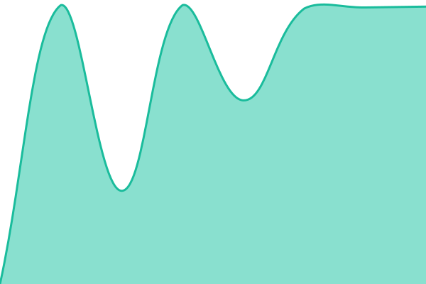
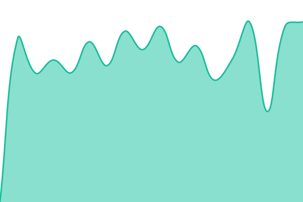
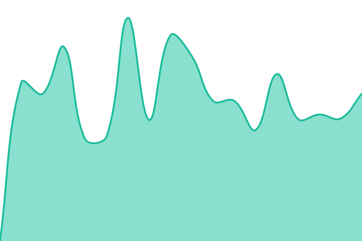

# [📈 Live Status](https://status.appixi.net): <!--live status--> **🟧 Partial outage**

This repository contains the open-source uptime monitor and status page for [Upptime](https://upptime.js.org), powered by [Upptime](https://github.com/upptime/upptime).

With [Upptime](https://upptime.js.org), you can get your own unlimited and free uptime monitor and status page, powered entirely by a GitHub repository. We use [Issues](https://github.com/upptime/upptime/issues) as incident reports, [Actions](https://github.com/uzumaki258/status/actions) as uptime monitors, and [Pages](https://status.appixi.net) for the status page.

<!--start: status pages-->
<!-- This summary is generated by Upptime (https://github.com/upptime/upptime) -->
<!-- Do not edit this manually, your changes will be overwritten -->
<!-- prettier-ignore -->
| URL | Status | History | Response Time | Uptime |
| --- | ------ | ------- | ------------- | ------ |
|  DataTrungWeb | 🟥 Down | [data-trung-web.yml](https://github.com/uzumaki258/status/commits/HEAD/history/data-trung-web.yml) | 

 52990ms
     
 | 

<a href="https://status.appixi.net/history/data-trung-web">0.00%</a>
    

|  MainDataLSWeb | 🟩 Up | [main-data-ls-web.yml](https://github.com/uzumaki258/status/commits/HEAD/history/main-data-ls-web.yml) | 

 227ms
     
 | 

<a href="https://status.appixi.net/history/main-data-ls-web">100.00%</a>
    

|  IMG SERVICE | 🟩 Up | [img-service.yml](https://github.com/uzumaki258/status/commits/HEAD/history/img-service.yml) | 

 576ms
     
 | 

<a href="https://status.appixi.net/history/img-service">100.00%</a>
    

|  Mobile Search LS | 🟩 Up | [mobile-search-ls.yml](https://github.com/uzumaki258/status/commits/HEAD/history/mobile-search-ls.yml) | 

 693ms
     
 | 

<a href="https://status.appixi.net/history/mobile-search-ls">100.00%</a>
    

|  Detail Mobile LS | 🟩 Up | [detail-mobile-ls.yml](https://github.com/uzumaki258/status/commits/HEAD/history/detail-mobile-ls.yml) | 

 150ms
     
 | 

<a href="https://status.appixi.net/history/detail-mobile-ls">100.00%</a>
    

|  Mobile Top Click | 🟩 Up | [mobile-top-click.yml](https://github.com/uzumaki258/status/commits/HEAD/history/mobile-top-click.yml) | 

 235ms
     
 | 

<a href="https://status.appixi.net/history/mobile-top-click">100.00%</a>
    

|  Mobile Search Tag | 🟩 Up | [mobile-search-tag.yml](https://github.com/uzumaki258/status/commits/HEAD/history/mobile-search-tag.yml) | 

 168ms
     
 | 

<a href="https://status.appixi.net/history/mobile-search-tag">100.00%</a>
    

|  Vultr Object | 🟩 Up | [vultr-object.yml](https://github.com/uzumaki258/status/commits/HEAD/history/vultr-object.yml) | 

 403ms
     
 | 

<a href="https://status.appixi.net/history/vultr-object">100.00%</a>
    

|  Third Party | 🟩 Up | [third-party.yml](https://github.com/uzumaki258/status/commits/HEAD/history/third-party.yml) | 

 1734ms
     
 | 

<a href="https://status.appixi.net/history/third-party">93.75%</a>
    

|  Third Party IMG | 🟩 Up | [third-party-img.yml](https://github.com/uzumaki258/status/commits/HEAD/history/third-party-img.yml) | 

 1275ms
     
 | 

<a href="https://status.appixi.net/history/third-party-img">93.90%</a>
    

|  Backup Uq | 🟥 Down | [backup-uq.yml](https://github.com/uzumaki258/status/commits/HEAD/history/backup-uq.yml) | 

 602ms
     
 | 

<a href="https://status.appixi.net/history/backup-uq">0.00%</a>
    

|  Backup Kg | 🟥 Down | [backup-kg.yml](https://github.com/uzumaki258/status/commits/HEAD/history/backup-kg.yml) | 

 456ms
     
 | 

<a href="https://status.appixi.net/history/backup-kg">0.00%</a>
    

|  Backup Cu | 🟥 Down | [backup-cu.yml](https://github.com/uzumaki258/status/commits/HEAD/history/backup-cu.yml) | 

 578ms
     
 | 

<a href="https://status.appixi.net/history/backup-cu">0.00%</a>
    

|  EMTK | 🟩 Up | [emtk.yml](https://github.com/uzumaki258/status/commits/HEAD/history/emtk.yml) | 

 1626ms
     
 | 

<a href="https://status.appixi.net/history/emtk">100.00%</a>
    

<!--end: status pages-->

[**Visit our status website →**](https://status.appixi.net)

## 📄 License

- Powered by: [Upptime](https://github.com/upptime/upptime)
- Code: [MIT](./LICENSE) © [Upptime](https://upptime.js.org)
- Data in the `./history` directory: [Open Database License](https://opendatacommons.org/licenses/odbl/1-0/)
